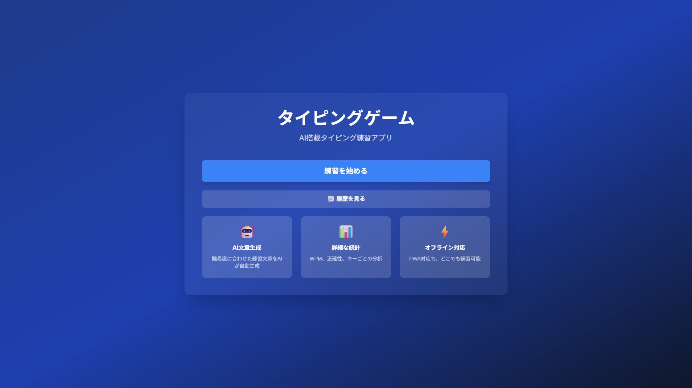

# ⌨️ タイピングゲーム - AI搭載練習アプリ

[](https://nextjs.org/)
[](https://reactjs.org/)
[](https://www.typescriptlang.org/)
[](https://tailwindcss.com/)
[](https://web.dev/progressive-web-apps/)
[](https://github.com/)
[](LICENSE)

AI（Google Gemini）を活用したタイピング練習アプリケーション。PWA対応により、オフラインでも利用可能です。

## 🌐 デモURL

**本番環境**: https://app036-typing-game-pu9fouysx.vercel.app

## 📸 スクリーンショット



*AI搭載タイピング練習アプリのホーム画面。シンプルで使いやすいUI*

## ✨ 特徴（Features）

- 🤖 **AI文章生成** - Google Gemini APIによる練習文章の自動生成。難易度別（初級・中級・上級）で最適な文章を提供
- 📊 **詳細な統計分析** - WPM（Words Per Minute）、正確性（Accuracy）、文字数をリアルタイム計測
- 🎨 **キーボードヒートマップ** - 各キーの正誤率を色分け表示。日本語IME完全対応で物理キーを正確に記録
- 💡 **AIアドバイス** - タイピング結果をAIが分析し、パーソナライズされた改善アドバイスを提供
- 📈 **履歴管理** - IndexedDBで過去20件のプレイ記録を保存。タイムスタンプ、スコア、難易度を一覧表示
- ⚡ **PWA対応** - Service Workerによる完全なオフライン動作、ホーム画面へのインストール可能
- 🔑 **APIキー設定UI** - ユーザーが自分のGemini APIキーを入力・保存・削除できるモーダルUI

## 🎯 主要機能の詳細

### AI文章生成システム
Google Gemini API（`gemini-2.5-flash`モデル）を使用して、難易度に応じた練習文章を動的に生成します。

- **初級（Beginner）**: 20-30文字の短文、常用漢字のみ
- **中級（Intermediate）**: 40-60文字の中文、記号を含む自然な文章
- **上級（Advanced）**: 80-120文字の長文、複雑な表現と記号

### キーボードヒートマップ（日本語IME対応）
`KeyboardEvent.code`を使用して物理キーを正確に記録。日本語IMEが有効でも、実際に押したキーを正確にトラッキングします。

- **技術的詳細**:
  - `KeyA` → `'a'`, `Digit1` → `'1'` へ正規化
  - IME関連キー（Process、Unidentified等）を自動除外
  - Backspaceキー検出でミスタイプを自動マーク

### 詳細統計
- **キーごとの分析**: 各キーの正誤率、平均入力時間を集計
- **苦手キー検出**: ミス率30%以上のキーを自動検出
- **指と手の割り当て**: QWERTY配列に基づく指配置情報

## 🛠️ 技術スタック

### フロントエンド
- **Next.js 14** - App Router、Server Actions
- **React 18** - Hooks（useState、useEffect、useCallback、useRef）
- **TypeScript 5** - 型安全な開発
- **Tailwind CSS v3** - ユーティリティファーストCSS

### AI・API
- **Google Gemini API** - `@google/genai` (2025推奨SDK)
- **モデル**: `gemini-2.5-flash` (テキスト生成・分析)

### データベース
- **IndexedDB** - Dexie.js経由でローカルストレージ

### テスト
- **Jest** - テストフレームワーク
- **React Testing Library** - コンポーネントテスト
- **Playwright** - E2Eテスト

### PWA
- **next-pwa** - Service Worker、Manifest
- **Workbox** - キャッシュ戦略

## 📦 セットアップ方法

### 前提条件
- **Node.js**: 18.x 以上
- **npm**: 9.x 以上

### インストール

```bash
# リポジトリをクローン
git clone https://github.com/takamiya1021/app036-typing-game.git
cd app036-typing-game

# 依存関係をインストール
npm install

# 環境変数の設定（オプション）
cp .env.local.example .env.local
# .env.localにGoogle Gemini API Keyを設定（任意）

# 開発サーバー起動
npm run dev
```

ブラウザで [http://localhost:3000](http://localhost:3000) を開きます。

### APIキーの取得（オプション）

アプリ内でAPIキー設定UIを使用することもできますが、環境変数で設定する場合：

1. [Google AI Studio](https://aistudio.google.com/app/apikey)にアクセス
2. 新しいAPIキーを作成
3. `.env.local`の`GEMINI_API_KEY`に設定、または
4. アプリ内の「🔑 AI設定」モーダルから設定

**注意**: APIキーが未設定の場合、デフォルトのフォールバック文章が使用されます。

## 🧪 テスト

```bash
# 全テスト実行
npm test

# ウォッチモード
npm test -- --watch

# カバレッジレポート
npm test -- --coverage

# E2Eテスト
npm run test:e2e
```

**テスト状況**: 174テスト / 100%合格 / カバレッジ80%以上

## 📁 プロジェクト構造

```
app036-typing-game/
├── app/                      # Next.js App Router
│   ├── actions/
│   │   └── ai.ts             # AI API Server Actions
│   ├── history/              # 履歴ページ
│   ├── practice/             # 練習ページ
│   ├── results/              # 結果ページ
│   ├── layout.tsx            # ルートレイアウト
│   └── page.tsx              # ホームページ
├── components/               # Reactコンポーネント
│   ├── AnalysisReport.tsx    # 分析レポート
│   ├── ApiKeyModal.tsx       # APIキー設定モーダル
│   ├── DifficultySelector.tsx # 難易度選択
│   ├── GameStats.tsx         # ゲーム統計表示
│   ├── KeyboardHeatmap.tsx   # キーボードヒートマップ
│   ├── Timer.tsx             # タイマー
│   └── TypingArea.tsx        # タイピング入力エリア
├── lib/
│   ├── api-key.ts            # APIキー管理
│   ├── db/
│   │   ├── client.ts         # Dexie.js設定
│   │   └── operations.ts     # DB操作
│   ├── typing/
│   │   ├── analyzer.ts       # キー統計分析
│   │   ├── calculator.ts     # WPM/正確性計算
│   │   └── validator.ts      # 入力検証
│   └── utils/
│       └── keyboard.ts       # キーボードレイアウト定義
├── public/
│   ├── manifest.json         # PWA Manifest
│   └── sw.js                 # Service Worker
├── doc/                      # ドキュメント
│   ├── requirements.md       # 要件定義書
│   ├── technical-design.md   # 技術設計書
│   └── implementation-plan.md # 実装計画書
└── __tests__/                # テスト
```

## 🏗️ ビルド & デプロイ

### ビルド

```bash
# プロダクションビルド
npm run build

# ビルド確認
npm start
```

### Vercelデプロイ

```bash
# Vercel CLIでデプロイ
vercel --prod --yes
```

または、GitHubにpushすると自動デプロイされます。

## 📚 開発ドキュメント

詳細な開発ドキュメントは`doc/`ディレクトリを参照してください：

- [要件定義書](doc/requirements.md) - 機能仕様、技術制約
- [技術設計書](doc/technical-design.md) - アーキテクチャ、データモデル
- [実装計画書](doc/implementation-plan.md) - TDD準拠の実装タスク

## 📊 開発手法

**TDD（Test-Driven Development）**で実装

- **Red → Green → Refactor** サイクル
- Phase 0-8の段階的実装
- 全テストパス + カバレッジ80%以上
- コミット規律: テストパス、警告ゼロ、単一論理作業単位

## 🤝 コントリビューション

プルリクエストを歓迎します！以下の手順で貢献してください：

1. このリポジトリをフォーク
2. フィーチャーブランチを作成 (`git checkout -b feature/amazing-feature`)
3. 変更をコミット (`git commit -m 'Add some amazing feature'`)
4. ブランチにプッシュ (`git push origin feature/amazing-feature`)
5. プルリクエストを作成

**注意**: プルリクエスト前に以下を確認してください：
- 全テストがパスすること (`npm test`)
- リンター/フォーマッターが通ること
- TDDサイクルに従っていること

## 📄 ライセンス

MIT License

## 👤 作者

**吉倉大晄 (Yoshikura Hiroaki)**

- GitHub: [@takamiya1021](https://github.com/takamiya1021)

## 🙏 謝辞

このプロジェクトは以下の技術・ツールを使用しています：

- [Next.js](https://nextjs.org/) - Reactフレームワーク
- [Google Gemini API](https://ai.google.dev/) - AI文章生成・分析
- [Tailwind CSS](https://tailwindcss.com/) - CSSフレームワーク
- [Dexie.js](https://dexie.org/) - IndexedDBラッパー
- [Jest](https://jestjs.io/) & [React Testing Library](https://testing-library.com/react) - テスト
- [Vercel](https://vercel.com/) - ホスティング
